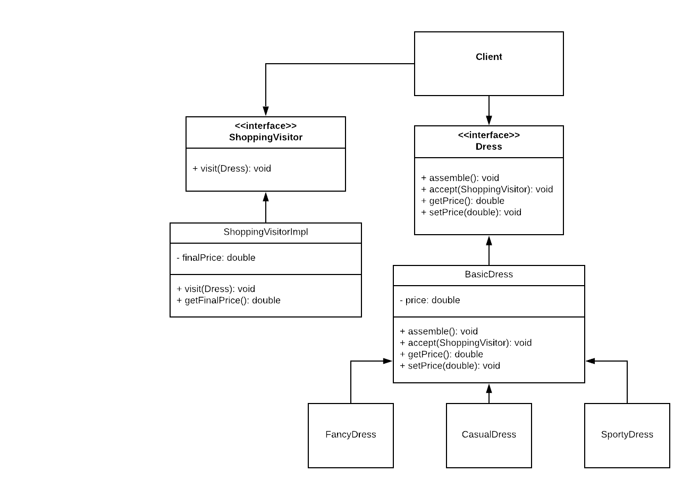

# COMP 373 Project 4 - Dress Types

## Summary
For this project, we have implemented the Visitor and Decorator patterns using the idea of various dress types. 

### How to Run:
1. Open project in Eclipse, IntelliJ, or any Java IDE.
2. Import the necessary requirements (JRE System Library JavaSE-1.8 & JUnit 5) 
3. Run file "DClient.java" as a "Java application" in order to view what prints from the Client side and see which artists are on tour. 

### Testing: 
We are using JUnit for running tests. Make sure to have JUnit 5 imported in your local environment in order to run the tests. 

## Specifications 
System Name: Dress Types

System Design: We designed a system that classifies dresses by their style. Using the Decorator design pattern, we were able to apply more than one style to a dress, as reflected in the code and in real world situations. We then used the Visitor pattern to be able to visit the dresses and change their price value by standard increments for all dresses in the Visitor implementation. 

Patterns Used: Visitor and Decorator

## UML Diagram
